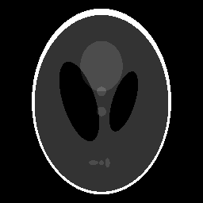

# MedicalImageRegistration.jl

A minimal Julia library for 2D and 3D medical image registration, inspired by [torchreg](https://github.com/codingfisch/torchreg).

## Demo


*The animation shows: static target → misaligned moving image → registration in progress → aligned result → checkerboard overlay comparison*

## Features

- **Affine Registration**: Translation, rotation, zoom, and shear optimization
- **SyN Registration**: Symmetric diffeomorphic (deformable) registration
- **Multiresolution**: Coarse-to-fine optimization for speed and robustness
- **2D and 3D**: Full support for both image dimensions
- **GPU Acceleration**: Transparent CPU/CUDA/Metal support via AcceleratedKernels.jl
- **Automatic Differentiation**: Mooncake.jl for gradient computation

## Installation

```julia
using Pkg
Pkg.add("MedicalImageRegistration")
```

## Quick Start

### Affine Registration

```julia
using MedicalImageRegistration
using Metal  # or CUDA for NVIDIA GPUs

# Load images as arrays (X, Y, Z, C, N) - Julia convention
moving = MtlArray(rand(Float32, 64, 64, 64, 1, 1))  # GPU array
static = MtlArray(rand(Float32, 64, 64, 64, 1, 1))

# Create registration object
reg = AffineRegistration{Float32}(
    is_3d=true,
    scales=(4, 2),
    iterations=(500, 100),
    array_type=MtlArray  # Use MtlArray for Metal GPU
)

# Run registration
moved = register(reg, moving, static)

# Access the affine matrix
affine = get_affine(reg)

# Apply transform to another image
another_moved = transform(reg, another_image)
```

### SyN (Diffeomorphic) Registration

```julia
reg = SyNRegistration{Float32}(
    scales=(4, 2, 1),
    iterations=(30, 30, 10),
    array_type=MtlArray
)
moved = register(reg, moving, static)
```

### Custom Loss Functions

```julia
reg = AffineRegistration{Float32}(
    is_3d=true,
    learning_rate=0.01f0
)

# Use dice_loss instead of default mse_loss
moved = register(reg, moving, static; loss_fn=dice_loss)
```

## Running the Demo

To run the interactive demo with TestImages.jl:

```bash
cd examples
julia demo.jl
```

This will:
1. Automatically detect and use Metal GPU (Apple Silicon) if available
2. Load a test image (cameraman)
3. Create a synthetically misaligned version
4. Run affine registration to recover alignment
5. Generate a GIF animation showing the process
6. Save output images to `examples/output/`

**GPU Acceleration**: The demo automatically uses Metal GPU on macOS with Apple Silicon. CPU fallback is used when GPU is not available.

## GPU Requirements

This package is designed with a **GPU-first architecture**. While it can run on CPU, optimal performance requires a GPU:

### Supported GPU Backends

| Backend | GPU Type | Package | Array Type |
|---------|----------|---------|------------|
| Metal | Apple Silicon (M1/M2/M3) | [Metal.jl](https://github.com/JuliaGPU/Metal.jl) | `MtlArray` |
| CUDA | NVIDIA GPUs | [CUDA.jl](https://github.com/JuliaGPU/CUDA.jl) | `CuArray` |
| ROCm | AMD GPUs | [AMDGPU.jl](https://github.com/JuliaGPU/AMDGPU.jl) | `ROCArray` |
| CPU | Any | (built-in) | `Array` |

### GPU Usage Example

```julia
# Metal (Apple Silicon)
using Metal
using MedicalImageRegistration

moving = MtlArray(load_image("moving.nii"))
static = MtlArray(load_image("static.nii"))
reg = AffineRegistration{Float32}(is_3d=true, array_type=MtlArray)
moved = register(reg, moving, static)

# CUDA (NVIDIA)
using CUDA
moving = CuArray(load_image("moving.nii"))
static = CuArray(load_image("static.nii"))
reg = AffineRegistration{Float32}(is_3d=true, array_type=CuArray)
moved = register(reg, moving, static)
```

### Performance Notes

- GPU acceleration provides 10-100x speedup over CPU for typical medical images
- Memory requirements scale with image size: expect ~4x image size for forward pass
- Multi-resolution pyramid reduces memory usage and improves convergence

## Intensity Conservation (HU Values)

When registering CT images, **intensity (Hounsfield Unit) conservation is not guaranteed** by default interpolation.

### Why HU Values Change

Image registration uses interpolation (bilinear/trilinear) to resample the moving image. Interpolation creates new pixel values by averaging nearby pixels, which can:

1. **Smooth edges**: Sharp boundaries between tissues become blurred
2. **Shift mean values**: Average HU in a region may change slightly
3. **Introduce new values**: Interpolated values may not exist in the original image

### HU-Preserving Mode (Nearest-Neighbor)

This package supports **hybrid interpolation mode** for HU preservation:

- **During optimization**: Bilinear/trilinear interpolation for smooth gradients
- **Final output**: Nearest-neighbor interpolation to preserve exact input values

```julia
# Register with HU preservation
reg = AffineRegistration{Float32}(is_3d=true)
moved = register(reg, moving_ct, static_ct; final_interpolation=:nearest)

# Output values are EXACT subset of input values (HU preserved)
@assert issubset(Set(moved), Set(moving_ct))  # True!

# Or use transform() with interpolation kwarg
moved_nearest = transform(reg, moving_ct; interpolation=:nearest)
```

### Recommendations for CT Images

| Use Case | Interpolation Mode | Code |
|----------|-------------------|------|
| **Visual alignment** | `:bilinear` (default) | `register(reg, moving, static)` |
| **Quantitative analysis** | `:nearest` | `register(reg, moving, static; final_interpolation=:nearest)` |
| **Dose calculation** | `:nearest` | `transform(reg, ct; interpolation=:nearest)` |
| **Segmentation transfer** | `:bilinear` + threshold | `transform(reg, mask) .> 0.5` |

### How Hybrid Mode Works

1. **Optimization phase**: Uses smooth bilinear/trilinear interpolation for gradient-based optimization
2. **Final output**: Applies the learned transformation with nearest-neighbor to preserve exact values

This ensures the registration converges properly (smooth gradients) while the final result preserves exact intensity values (no interpolation artifacts).

### Shepp-Logan Phantom Demo: Standard vs HU-Preserving

The following demo compares standard bilinear interpolation with HU-preserving nearest-neighbor mode using the Shepp-Logan phantom:

| Standard (Bilinear) | HU-Preserving (Nearest) |
|---------------------|-------------------------|
|  |  |

**Quantitative Results:**

| Metric | Standard (Bilinear) | HU-Preserving (Nearest) |
|--------|---------------------|-------------------------|
| New values created | 2559 | 0 |
| All values from input | No | Yes |
| Suitable for quantitative analysis | No | Yes |

Run the demo yourself:

```bash
cd examples
julia demo_hu_preservation.jl
```

This demo:
1. Loads the Shepp-Logan phantom (256x256)
2. Creates synthetic misalignment (translation, rotation, zoom)
3. Runs registration with both interpolation modes
4. Generates comparison GIFs and intensity histograms
5. Prints quantitative analysis showing value preservation

## Array Conventions

Julia uses column-major order. This package follows Julia conventions:

| Dimension | Julia (this package) | PyTorch (torchreg) |
|-----------|---------------------|-------------------|
| Spatial   | (X, Y) or (X, Y, Z) | (Y, X) or (Z, Y, X) |
| Full 2D   | (X, Y, C, N)        | (N, C, Y, X) |
| Full 3D   | (X, Y, Z, C, N)     | (N, C, Z, Y, X) |

## API Reference

### Core Types

```julia
# Affine Registration
AffineRegistration{T}(;
    is_3d::Bool=true,           # 3D (true) or 2D (false)
    scales::Tuple=(4, 2),       # Multi-resolution pyramid scales
    iterations::Tuple=(500, 100), # Iterations per scale
    learning_rate::T=0.01,      # Optimizer learning rate
    with_translation::Bool=true, # Enable translation
    with_rotation::Bool=true,    # Enable rotation
    with_zoom::Bool=true,        # Enable zoom/scale
    with_shear::Bool=false,      # Enable shear
    align_corners::Bool=true,    # Grid sampling mode
    padding_mode::Symbol=:border, # :zeros or :border
    array_type::Type=Array       # Array type for GPU
)

# SyN (Diffeomorphic) Registration
SyNRegistration{T}(;
    scales::Tuple=(4, 2, 1),    # Multi-resolution scales
    iterations::Tuple=(30, 30, 10), # Iterations per scale
    learning_rate::T=0.01,      # Optimizer learning rate
    sigma_flow::T=1.0,          # Flow smoothing sigma
    sigma_img::T=0.0,           # Image smoothing sigma
    lambda_::T=1.0,             # Regularization weight
    time_steps::Int=7,          # Scaling-and-squaring steps
    array_type::Type=Array      # Array type for GPU
)
```

### Functions

```julia
# Registration
register(reg, moving, static; loss_fn=mse_loss, verbose=true, final_interpolation=:bilinear)
fit!(reg, moving, static; loss_fn=mse_loss, verbose=true)
transform(reg, image; direction=:forward, interpolation=:bilinear)  # Apply learned transform
reset!(reg)  # Reset parameters to identity

# Affine-specific
get_affine(reg)  # Get current affine matrix
affine_transform(image, theta; interpolation=:bilinear)  # Apply explicit affine matrix
compose_affine(translation, rotation, zoom, shear)  # Build affine matrix
affine_grid(theta, size)  # Generate sampling grid from affine

# Loss Functions
mse_loss(pred, target)  # Mean Squared Error
dice_loss(pred, target)  # 1 - Dice coefficient
dice_score(pred, target) # Dice coefficient
ncc_loss(pred, target; kernel_size=9)  # Normalized Cross Correlation

# Low-level Operations
grid_sample(input, grid; padding_mode=:zeros, align_corners=true, interpolation=:bilinear)
spatial_transform(image, displacement; interpolation=:bilinear)  # Warp with displacement field
diffeomorphic_transform(velocity; time_steps=7)  # Scaling-and-squaring

# Interpolation Modes
# :bilinear/:trilinear - Smooth gradients, creates new values (default)
# :nearest - HU-preserving, returns exact input values, zero gradients
```

## Dependencies

- [AcceleratedKernels.jl](https://github.com/JuliaGPU/AcceleratedKernels.jl) - GPU acceleration (CPU/CUDA/Metal/ROCm)
- [Mooncake.jl](https://github.com/compintell/Mooncake.jl) - Automatic differentiation
- [Atomix.jl](https://github.com/JuliaGPU/Atomix.jl) - Atomic operations for GPU

## License

MIT
